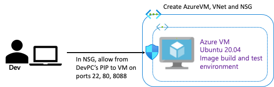
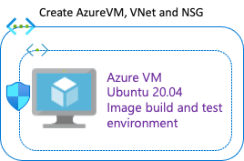
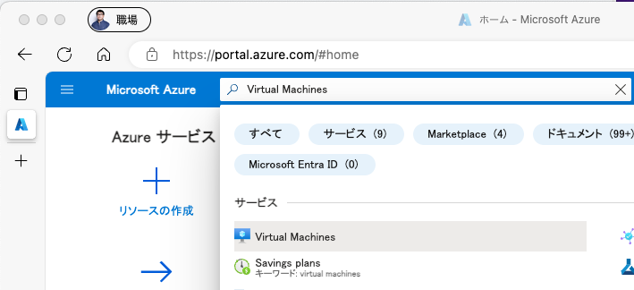
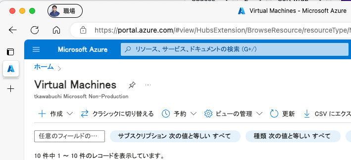
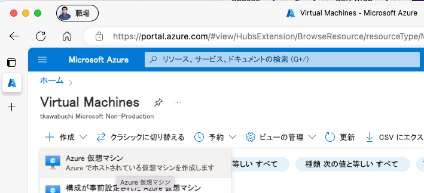
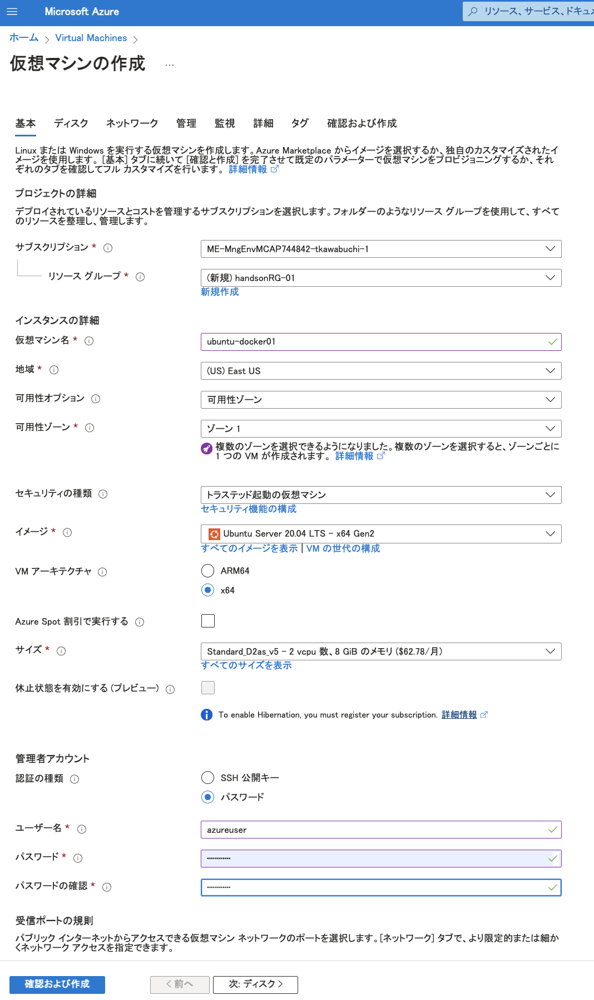
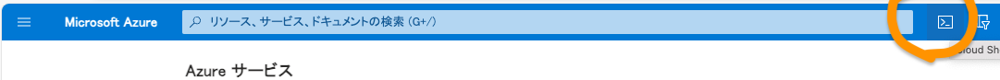
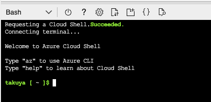
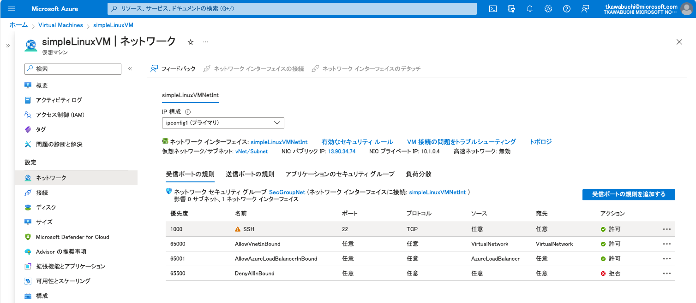
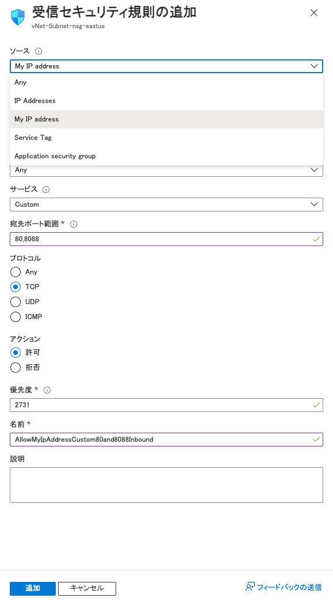

# Task01: docker build 用 VM を作成

<BR>
<BR>

docker build および、テスト環境として、Azure VM Ubuntu 20.04 を作成し、自身のPC から SSH 接続できるようにします。
また、Port 80 および 8088 で自身の PC からアクセスできるようにします。

## 1. Azure Portal より GUI で VM 作成する場合

<BR>
<BR>

bicep（ IaC ） を利用する場合は、こちらはとばして [2.へ](01-create-a-vm-for-docker-build.md#2-bicep-で-vm-の作成)
1. https://portal.azure.com/ の上部で `Virtual Machines`を検索し、サービスから`Virtual Machines`をクリック
   
<BR>
<BR>

<BR>
<BR>

3. `＋ 作成`をクリック

<BR>
<BR>

<BR>
<BR>

4. `Azure 仮想マシン`をクリックしてVMを新規に作成

<BR>
<BR>

<BR>
<BR>

以下設定値
* サブスクリプション:　今回のHandsOn用のものであることを確認してください
* host名: ubuntu-docker01（任意のhost名）
* リソースグループ： handsonRG-NN（同一 Azure　サブスクリプション内でユニークなRG名、NNはチーム独自の数字など）
* 地域： (Asia Pacific) Japan East （任意のリージョン）
* イメージ： Ubuntu Server 20.04 LTS - x64 Gen2
* 認証の種類: パスワード（本来は鍵認証を推奨）
* ユーザー名： azureuser
* パスワード/パスワードの確認：P@ssword1234（推測されにくい任意のパスワード）
* その他：デフォルト値

<BR>
<BR>

<BR>
<BR>

> [!WARNING]
> * サブスクリプションについて、必ず今回のHandsOn用のものであることを確認してください。
> * 商用環境で利用しているサブスクリプションへ誤ってデプロイしないように注意してください。
> * また、複数チームで同一のサブスクリプションを利用している場合、リソースグループの後に参加チーム独自の数字をつけるなどして、重複しないようユニークとなるようにしてください。

## 2. bicep で VM の作成

<BR>
<BR>

Azure Portal より、すでに GUI でVMを作成済みの場合は、こちらを飛ばして　[3.へ](01-create-a-vm-for-docker-build.md#3-azure-portal--bicep共通-作成した-vm-を-azure-portal-で表示してネットワーク-セキュリティ-グループを変更追加する)

以下を参考にに bicep( IaC )で VM を作成します。

https://learn.microsoft.com/ja-jp/azure/virtual-machines/linux/quick-create-bicep

Azure Portal より `Cloud Shell`　(bash)を開きます。

<BR>
<BR>

<BR>
<BR>
<BR>
<BR>

<BR>
<BR>

> [!WARNING]
> サブスクリプションについて、必ず今回のHandsOn用のものであることを確認してください。
> 商用環境で利用しているサブスクリプションへ誤ってデプロイしないように注意してください。
> ```
> # 利用可能なサブスクリプションを表示
> az account list --output table
> # 現在利用中のサブスクリプションを表示
> az account show
> # もし異なる場合
> az account set --subscription [SubscriptionId] 
> ```

```
# bicep ファイルのダウンロード
wget https://raw.githubusercontent.com/Azure/azure-quickstart-templates/master/quickstarts/microsoft.compute/vm-simple-linux/main.bicep

# リソースグループの作成
az group create --name handsonRG --location japaneast

# Azure VM ubuntu 20.04 LTSの作成、 プロンプトより、adminpassword入力
az deployment group create --resource-group handsonRG --template-file main.bicep --parameters adminUsername=azureuser
```

<details>
<summary>実行結果の例（ここをクリックして開く）</summary>

```
takuya [ ~ ]$ wget https://raw.githubusercontent.com/Azure/azure-quickstart-templates/master/quickstarts/microsoft.compute/vm-simple-linux/main.bicep
--2023-11-24 10:07:52--  https://raw.githubusercontent.com/Azure/azure-quickstart-templates/master/quickstarts/microsoft.compute/vm-simple-linux/main.bicep
Resolving raw.githubusercontent.com... 185.199.108.133, 185.199.109.133, 185.199.110.133, ...
Connecting to raw.githubusercontent.com|185.199.108.133|:443... connected.
HTTP request sent, awaiting response... 200 OK
Length: 6198 (6.1K) [text/plain]
Saving to: ‘main.bicep’

main.bicep                                           100%[======================================================================================================================>]   6.05K  --.-KB/s    in 0s      

2023-11-24 10:07:53 (49.6 MB/s) - ‘main.bicep’ saved [6198/6198]

takuya [ ~ ]$ az group create --name handsonRG --location eastus
{
  "id": "/subscriptions/YOURSUBSCRIPTION/resourceGroups/handsonRG",
  "location": "eastus",
  "managedBy": null,
  "name": "handsonRG",
  "properties": {
    "provisioningState": "Succeeded"
  },
  "tags": null,
  "type": "Microsoft.Resources/resourceGroups"
}
takuya [ ~ ]$ az deployment group create --resource-group handsonRG --template-file main.bicep --parameters adminUsername=azureuser
The configuration value of bicep.use_binary_from_path has been set to 'false'.
Please provide securestring value for 'adminPasswordOrKey' (? for help): 
{
  "id": "/subscriptions/YOURSUBSCRIPTION/resourceGroups/handsonRG/providers/Microsoft.Resources/deployments/main",
  "location": null,
  "name": "main",
  "properties": {
    "correlationId": "dd60e5e1-6dd6-4d3d-9afa-066af7a3af34",
    "debugSetting": null,
    "dependencies": [
      {
        "dependsOn": [
          {
            "id": "/subscriptions/YOURSUBSCRIPTION/resourceGroups/handsonRG/providers/Microsoft.Network/networkSecurityGroups/SecGroupNet",
            "resourceGroup": "handsonRG",
            "resourceName": "SecGroupNet",
            "resourceType": "Microsoft.Network/networkSecurityGroups"
          },
          {
            "id": "/subscriptions/YOURSUBSCRIPTION/resourceGroups/handsonRG/providers/Microsoft.Network/publicIPAddresses/simpleLinuxVMPublicIP",
            "resourceGroup": "handsonRG",
            "resourceName": "simpleLinuxVMPublicIP",
            "resourceType": "Microsoft.Network/publicIPAddresses"
          },
          {
            "id": "/subscriptions/YOURSUBSCRIPTION/resourceGroups/handsonRG/providers/Microsoft.Network/virtualNetworks/vNet/subnets/Subnet",
            "resourceGroup": "handsonRG",
            "resourceName": "vNet/Subnet",
            "resourceType": "Microsoft.Network/virtualNetworks/subnets"
          }
        ],
        "id": "/subscriptions/YOURSUBSCRIPTION/resourceGroups/handsonRG/providers/Microsoft.Network/networkInterfaces/simpleLinuxVMNetInt",
        "resourceGroup": "handsonRG",
        "resourceName": "simpleLinuxVMNetInt",
        "resourceType": "Microsoft.Network/networkInterfaces"
      },
      {
        "dependsOn": [
          {
            "id": "/subscriptions/YOURSUBSCRIPTION/resourceGroups/handsonRG/providers/Microsoft.Network/virtualNetworks/vNet",
            "resourceGroup": "handsonRG",
            "resourceName": "vNet",
            "resourceType": "Microsoft.Network/virtualNetworks"
          }
        ],
        "id": "/subscriptions/YOURSUBSCRIPTION/resourceGroups/handsonRG/providers/Microsoft.Network/virtualNetworks/vNet/subnets/Subnet",
        "resourceGroup": "handsonRG",
        "resourceName": "vNet/Subnet",
        "resourceType": "Microsoft.Network/virtualNetworks/subnets"
      },
      {
        "dependsOn": [
          {
            "id": "/subscriptions/YOURSUBSCRIPTION/resourceGroups/handsonRG/providers/Microsoft.Network/networkInterfaces/simpleLinuxVMNetInt",
            "resourceGroup": "handsonRG",
            "resourceName": "simpleLinuxVMNetInt",
            "resourceType": "Microsoft.Network/networkInterfaces"
          }
        ],
        "id": "/subscriptions/YOURSUBSCRIPTION/resourceGroups/handsonRG/providers/Microsoft.Compute/virtualMachines/simpleLinuxVM",
        "resourceGroup": "handsonRG",
        "resourceName": "simpleLinuxVM",
        "resourceType": "Microsoft.Compute/virtualMachines"
      },
      {
        "dependsOn": [
          {
            "id": "/subscriptions/YOURSUBSCRIPTION/resourceGroups/handsonRG/providers/Microsoft.Compute/virtualMachines/simpleLinuxVM",
            "resourceGroup": "handsonRG",
            "resourceName": "simpleLinuxVM",
            "resourceType": "Microsoft.Compute/virtualMachines"
          }
        ],
        "id": "/subscriptions/YOURSUBSCRIPTION/resourceGroups/handsonRG/providers/Microsoft.Compute/virtualMachines/simpleLinuxVM/extensions/GuestAttestation",
        "resourceGroup": "handsonRG",
        "resourceName": "simpleLinuxVM/GuestAttestation",
        "resourceType": "Microsoft.Compute/virtualMachines/extensions"
      }
    ],
    "duration": "PT1M35.8467042S",
    "error": null,
    "mode": "Incremental",
    "onErrorDeployment": null,
    "outputResources": [
      {
        "id": "/subscriptions/YOURSUBSCRIPTION/resourceGroups/handsonRG/providers/Microsoft.Compute/virtualMachines/simpleLinuxVM",
        "resourceGroup": "handsonRG"
      },
      {
        "id": "/subscriptions/YOURSUBSCRIPTION/resourceGroups/handsonRG/providers/Microsoft.Compute/virtualMachines/simpleLinuxVM/extensions/GuestAttestation",
        "resourceGroup": "handsonRG"
      },
      {
        "id": "/subscriptions/YOURSUBSCRIPTION/resourceGroups/handsonRG/providers/Microsoft.Network/networkInterfaces/simpleLinuxVMNetInt",
        "resourceGroup": "handsonRG"
      },
      {
        "id": "/subscriptions/YOURSUBSCRIPTION/resourceGroups/handsonRG/providers/Microsoft.Network/networkSecurityGroups/SecGroupNet",
        "resourceGroup": "handsonRG"
      },
      {
        "id": "/subscriptions/YOURSUBSCRIPTION/resourceGroups/handsonRG/providers/Microsoft.Network/publicIPAddresses/simpleLinuxVMPublicIP",
        "resourceGroup": "handsonRG"
      },
      {
        "id": "/subscriptions/YOURSUBSCRIPTION/resourceGroups/handsonRG/providers/Microsoft.Network/virtualNetworks/vNet",
        "resourceGroup": "handsonRG"
      },
      {
        "id": "/subscriptions/YOURSUBSCRIPTION/resourceGroups/handsonRG/providers/Microsoft.Network/virtualNetworks/vNet/subnets/Subnet",
        "resourceGroup": "handsonRG"
      }
    ],
    "outputs": {
      "adminUsername": {
        "type": "String",
        "value": "azureuser"
      },
      "hostname": {
        "type": "String",
        "value": "simplelinuxvm-xcxb5sdshu5ae.eastus.cloudapp.azure.com"
      },
      "sshCommand": {
        "type": "String",
        "value": "ssh azureuser@simplelinuxvm-xcxb5sdshu5ae.eastus.cloudapp.azure.com"
      }
    },
    "parameters": {
      "adminPasswordOrKey": {
        "type": "SecureString"
      },
      "adminUsername": {
        "type": "String",
        "value": "azureuser"
      },
      "authenticationType": {
        "type": "String",
        "value": "password"
      },
      "dnsLabelPrefix": {
        "type": "String",
        "value": "simplelinuxvm-xcxb5sdshu5ae"
      },
      "location": {
        "type": "String",
        "value": "eastus"
      },
      "networkSecurityGroupName": {
        "type": "String",
        "value": "SecGroupNet"
      },
      "securityType": {
        "type": "String",
        "value": "TrustedLaunch"
      },
      "subnetName": {
        "type": "String",
        "value": "Subnet"
      },
      "ubuntuOSVersion": {
        "type": "String",
        "value": "Ubuntu-2004"
      },
      "virtualNetworkName": {
        "type": "String",
        "value": "vNet"
      },
      "vmName": {
        "type": "String",
        "value": "simpleLinuxVM"
      },
      "vmSize": {
        "type": "String",
        "value": "Standard_D2s_v3"
      }
    },
    "parametersLink": null,
    "providers": [
      {
        "id": null,
        "namespace": "Microsoft.Network",
        "providerAuthorizationConsentState": null,
        "registrationPolicy": null,
        "registrationState": null,
        "resourceTypes": [
          {
            "aliases": null,
            "apiProfiles": null,
            "apiVersions": null,
            "capabilities": null,
            "defaultApiVersion": null,
            "locationMappings": null,
            "locations": [
              "eastus"
            ],
            "properties": null,
            "resourceType": "networkInterfaces",
            "zoneMappings": null
          },
          {
            "aliases": null,
            "apiProfiles": null,
            "apiVersions": null,
            "capabilities": null,
            "defaultApiVersion": null,
            "locationMappings": null,
            "locations": [
              "eastus"
            ],
            "properties": null,
            "resourceType": "networkSecurityGroups",
            "zoneMappings": null
          },
          {
            "aliases": null,
            "apiProfiles": null,
            "apiVersions": null,
            "capabilities": null,
            "defaultApiVersion": null,
            "locationMappings": null,
            "locations": [
              "eastus"
            ],
            "properties": null,
            "resourceType": "virtualNetworks",
            "zoneMappings": null
          },
          {
            "aliases": null,
            "apiProfiles": null,
            "apiVersions": null,
            "capabilities": null,
            "defaultApiVersion": null,
            "locationMappings": null,
            "locations": [
              null
            ],
            "properties": null,
            "resourceType": "virtualNetworks/subnets",
            "zoneMappings": null
          },
          {
            "aliases": null,
            "apiProfiles": null,
            "apiVersions": null,
            "capabilities": null,
            "defaultApiVersion": null,
            "locationMappings": null,
            "locations": [
              "eastus"
            ],
            "properties": null,
            "resourceType": "publicIPAddresses",
            "zoneMappings": null
          }
        ]
      },
      {
        "id": null,
        "namespace": "Microsoft.Compute",
        "providerAuthorizationConsentState": null,
        "registrationPolicy": null,
        "registrationState": null,
        "resourceTypes": [
          {
            "aliases": null,
            "apiProfiles": null,
            "apiVersions": null,
            "capabilities": null,
            "defaultApiVersion": null,
            "locationMappings": null,
            "locations": [
              "eastus"
            ],
            "properties": null,
            "resourceType": "virtualMachines",
            "zoneMappings": null
          },
          {
            "aliases": null,
            "apiProfiles": null,
            "apiVersions": null,
            "capabilities": null,
            "defaultApiVersion": null,
            "locationMappings": null,
            "locations": [
              "eastus"
            ],
            "properties": null,
            "resourceType": "virtualMachines/extensions",
            "zoneMappings": null
          }
        ]
      }
    ],
    "provisioningState": "Succeeded",
    "templateHash": "5903517927080867595",
    "templateLink": null,
    "timestamp": "2023-11-24T10:00:54.439587+00:00",
    "validatedResources": null
  },
  "resourceGroup": "handsonRG",
  "tags": null,
  "type": "Microsoft.Resources/deployments"
}
takuya [ ~ ]$ 
```

</details>


## 3. 　(Azure Portal & bicep共通) 作成した VM を Azure Portal で表示して、`ネットワーク セキュリティ グループ`を変更・追加する

<BR>
<BR>

SSH接続（22番ポートのアクセス）をAnyから自分のPCのパブリックIPへ変更
* [ネットワーク]をクリックし、表示された受信の Network グループ の `SSH` をクリック

<BR>
<BR>

<BR>
<BR>

* ソースを`Any`から、`My IP address`（`Cloud Shell`からSSH接続する場合は、ソースを`IP address`として以下Tip参照し、`Cloud Shell`のPublicIPアドレスを設定）へ変更して保存

> [!TIP]
> `Cloud Shell`等で CLI で 接続元パブリックIPアドレス確認する場合は、 `ifconfig.me`等を利用します。
> ```
> curl ifconfig.me
> ```

つづいて、port 80 および 8088 での外部（自身のPC）からのアクセスを許可するため `受信ポートの規則を追加する`をクリック
以下設定値で登録
* ソース:　`My IP address`　
* 宛先ポート範囲: `80,8088`
* プロトコル: `TCP`
* 名前：　`AllowMyIpAddressCustom80and8088Inbound`(カンマは利用できないので除去)
* その他：デフォルト値

<BR>
<BR>

<BR>
<BR>

新規に`ネットワーク セキュリティ グループ`が追加できたら

以上でこちらのタスクは完了です。

---

## アジェンダ
+ [TASK0: 事前準備](README.md#task0-%E4%BA%8B%E5%89%8D%E6%BA%96%E5%82%99)
+ [TASK1: docker build 用 VM を作成](01-create-a-vm-for-docker-build.md)
+ [TASK2: VM でのコンテンツの手動デプロイを体感](02-vm-manual-deploy.md)
+ [TASK3: Azure Container Apps でのコンテンツの手動デプロイを体感](03-containerapps-manual-deploy.md)
+ [TASK4: Azure Container Apps での CI/CD を体感](04-containerapps-cicd.md)
+ [TASK5: Azure WebApp for containers でのコンテンツの手動デプロイを体感](05-webapp-manual-deploy.md)
+ [TASK6: Azure WebApp for containers での CI/CD を体感](06-webapp-cicd.md)
