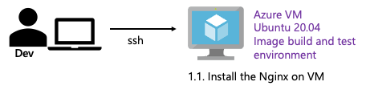

# Task02: VM でのコンテンツの手動デプロイを体感

<BR>
<BR>

* VM （Ubuntu20.04LTS）上にNginxをインストールし、コンテンツを手動でデプロイします。
* また、同様にコンテナを利用したコンテンツの手動デプロイを行います。

## 1. VM でのコンテンツの手動デプロイ
### 1.1. 事前準備 Nginx のインストール

<BR>
<BR>

VM の PublicIP(Azure Portal の VM の概要画面より確認可能) へ SSH で接続し、Nginx を CLI でインストールします。

```
# VM の PublicIP* を環境変数に設定 
VMPIP="AAA.BBB.CCC.DDD"
# azureuserで接続
ssh azureuser@$VMPIP
```

Terminal より 　Nginx をインストールします。

```
# apt update
sudo apt update -y
# nginx のインストール
sudo apt install nginx -y
# nginx のバージョン確認
sudo nginx -v
# nginx のデーモンの起動状態を確認
sudo systemctl status nginx
# Ctl+C systemctl を抜ける
```

実行結果の例
``` bash
azureuser@simpleLinuxVM:~$ # apt update
azureuser@simpleLinuxVM:~$ sudo apt update -y
Hit:1 http://azure.archive.ubuntu.com/ubuntu focal InRelease
〜〜中略〜〜                                   
All packages are up to date.
azureuser@simpleLinuxVM:~$ # nginx のインストール
azureuser@simpleLinuxVM:~$ sudo apt install nginx -y
Reading package lists... Done
〜〜中略〜〜
Setting up nginx-core (1.18.0-0ubuntu1.4) ...
Setting up nginx (1.18.0-0ubuntu1.4) ...
Processing triggers for ufw (0.36-6ubuntu1.1) ...
Processing triggers for systemd (245.4-4ubuntu3.22) ...
Processing triggers for man-db (2.9.1-1) ...
Processing triggers for libc-bin (2.31-0ubuntu9.12) ...
azureuser@simpleLinuxVM:~$ # nginx のバージョン確認
azureuser@simpleLinuxVM:~$sudo nginx -v
nginx version: nginx/1.18.0 (Ubuntu)
azureuser@simpleLinuxVM:~$ # nginx のデーモンの起動状態を確認
azureuser@simpleLinuxVM:~$ sudo systemctl status nginx
● nginx.service - A high performance web server and a reverse proxy server
     Loaded: loaded (/lib/systemd/system/nginx.service; enabled; vendor preset: enabled)
     Active: active (running) since Mon 2023-11-27 02:34:53 UTC; 13min ago
       Docs: man:nginx(8)
   Main PID: 16183 (nginx)
      Tasks: 3 (limit: 9456)
     Memory: 5.7M
     CGroup: /system.slice/nginx.service
             ├─16183 nginx: master process /usr/sbin/nginx -g daemon on; master_process >
             ├─16184 nginx: worker process
             └─16185 nginx: worker process

Nov 27 02:34:53 simpleLinuxVM systemd[1]: Starting A high performance web server and a r>
Nov 27 02:34:53 simpleLinuxVM systemd[1]: Started A high performance web server and a re>

azureuser@simpleLinuxVM:~$ 
```

Nginx が起動できたので、ブラウザより VM のパブリック IP へアクセスし`http://<VMパブリックIP>`、 nginx のデフォルトページが表示されることを確認します。

<BR>
<BR>

<BR>
<BR>

### 1.2. コンテンツの手動デプロイ

<BR>
<BR>

Github から取得したコンテンツを Nginx へ手動デプロイします。

Ubuntu20.04 での nginx 1.18 デフォルトの document root は、`/var/www/html`なので、コンテンツを変更して確認します。

> [!TIP]
> nginx の document root はバージョン等によりことなるので設定より確認しておきます。
> <details>
> <summary>　document root の確認方法(クリックして開く)</summary>
> 
> ```
> azureuser@simpleLinuxVM~$ cat /etc/nginx/nginx.conf | grep -v "#"
> user www-data;
> worker_processes auto;
> pid /run/nginx.pid;
> include /etc/nginx/modules-enabled/*.conf;
> 
> events {
> 	worker_connections 768;
> }
> 
> http {
> 
> 
> 	sendfile on;
> 	tcp_nopush on;
> 	tcp_nodelay on;
> 	keepalive_timeout 65;
> 	types_hash_max_size 2048;
> 
> 
> 	include /etc/nginx/mime.types;
> 	default_type application/octet-stream;
> 
> 
> 	ssl_prefer_server_ciphers on;
> 
> 
> 	access_log /var/log/nginx/access.log;
> 	error_log /var/log/nginx/error.log;
> 
> 
> 	gzip on;
> 
> 
> 
> 	include /etc/nginx/conf.d/*.conf;
> 	include /etc/nginx/sites-enabled/*;
> }
> azureuser@simpleLinuxVM:~$ ll /etc/nginx/conf.d/
> total 8
> drwxr-xr-x 2 root root 4096 Nov 10  2022 ./
> drwxr-xr-x 8 root root 4096 Nov 27 02:34 ../
> azureuser@simpleLinuxVM:~$ ll /etc/nginx/sites-enabled/
> total 8
> drwxr-xr-x 2 root root 4096 Nov 27 02:34 ./
> drwxr-xr-x 8 root root 4096 Nov 27 02:34 ../
> lrwxrwxrwx 1 root root   34 Nov 27 02:34 default -> /etc/nginx/sites-available/default
> azureuser@simpleLinuxVM:~$ cat /etc/nginx/sites-available/default | grep "root"　 | grep -v "#"
> 	root /var/www/html;
> azureuser@simpleLinuxVM:~$
> azureuser@simpleLinuxVM:~$ ll /var/www/html/
> total 12
> drwxr-xr-x 2 root root 4096 Nov 27 02:56 ./
> drwxr-xr-x 3 root root 4096 Nov 27 02:34 ../
> -rw-r--r-- 1 root root  615 Nov 27 02:56 index.nginx-debian.html
> azureuser@simpleLinuxVM:~$
> ```
> 
> </details>

Terminal に戻り、document root `/var/www/html/`へ新規に`index.html`を追加します。

``` bash
sudo bash -c 'cat <<EOF > /var/www/html/index.html
<html>
         <body>
THIS IS TEST PAGE!!!!
        </body>
</html>
EOF'
```

再び、ブラウザより VM のパブリック IP へアクセスし`http://<VMパブリックIP>`、 コンテンツが変更されたことを確認します。
<BR>
<BR>

<BR>
<BR>

つづいて、Github 上からコンテンツを取得し、`/var/www/html/`へデプロイしていきます。

``` bash
# ~へ移動
cd ~
# Github からコンテンツを取得
git clone https://github.com/tbuchi888/demo-js-nginx-docker-k8s
# 取得した git のディレクトリへ移動し、中身を確認
cd demo-js-nginx-docker-k8s/
ll
# html ディレクトリ（コンテンツ） の中身を document root へコピー
sudo cp -pr html/* /var/www/html/
# document root を確認
ll /var/www/html/
```

実行結果の例
``` bash
azureuser@simpleLinuxVM:~$ # ~へ移動
azureuser@simpleLinuxVM:~$ cd
azureuser@simpleLinuxVM:~$ # Github からコンテンツを取得
azureuser@simpleLinuxVM:~$ git clone https://github.com/tbuchi888/demo-js-nginx-docker-k8s
Cloning into 'demo-js-nginx-docker-k8s'...
remote: Enumerating objects: 471, done.
remote: Counting objects: 100% (350/350), done.
remote: Compressing objects: 100% (101/101), done.
remote: Total 471 (delta 145), reused 336 (delta 138), pack-reused 121
Receiving objects: 100% (471/471), 90.37 KiB | 8.21 MiB/s, done.
Resolving deltas: 100% (196/196), done.
azureuser@simpleLinuxVM:~$ # 取得した git のディレクトリへ移動し、中身を確認
azureuser@simpleLinuxVM:~$ cd demo-js-nginx-docker-k8s/
azureuser@simpleLinuxVM:~/demo-js-nginx-docker-k8s$ ll
total 48
drwxrwxr-x 7 azureuser azureuser 4096 Nov 27 03:30 ./
drwxr-xr-x 5 azureuser azureuser 4096 Nov 27 03:30 ../
drwxrwxr-x 8 azureuser azureuser 4096 Nov 27 03:30 .git/
drwxrwxr-x 3 azureuser azureuser 4096 Nov 27 03:30 .github/
-rw-rw-r-- 1 azureuser azureuser   11 Nov 27 03:30 .gitignore
-rw-rw-r-- 1 azureuser azureuser  283 Nov 27 03:30 Dockerfile
-rw-rw-r-- 1 azureuser azureuser 1057 Nov 27 03:30 LICENSE
drwxrwxr-x 4 azureuser azureuser 4096 Nov 27 03:30 html/
drwxrwxr-x 2 azureuser azureuser 4096 Nov 27 03:30 k8s/
drwxrwxr-x 2 azureuser azureuser 4096 Nov 27 03:30 manifests/
-rw-rw-r-- 1 azureuser azureuser  862 Nov 27 03:30 readme.md
-rw-rw-r-- 1 azureuser azureuser    3 Nov 27 03:30 version
azureuser@simpleLinuxVM:~/demo-js-nginx-docker-k8s$ # html ディレクトリ（コンテンツ） の中身を document root へコピー
azureuser@simpleLinuxVM:~/demo-js-nginx-docker-k8s$ sudo cp -pr html/* /var/www/html/
azureuser@simpleLinuxVM:~/demo-js-nginx-docker-k8s$ # document root を確認
azureuser@simpleLinuxVM:~/demo-js-nginx-docker-k8s$ ll /var/www/html/
total 28
drwxr-xr-x 4 root      root      4096 Nov 27 03:31 ./
drwxr-xr-x 3 root      root      4096 Nov 27 02:34 ../
drwxrwxr-x 2 azureuser azureuser 4096 Nov 27 03:30 css/
-rwxrwxr-x 1 azureuser azureuser  985 Nov 27 03:30 index.html*
-rw-r--r-- 1 root      root       612 Nov 27 03:14 index.nginx-debian.html
drwxrwxr-x 2 azureuser azureuser 4096 Nov 27 03:30 js/
-rw-rw-r-- 1 azureuser azureuser 1967 Nov 27 03:30 particles.json
azureuser@simpleLinuxVM:~/demo-js-nginx-docker-k8s$ 
```

コンテンツの配置（デプロイ）が完了したため
再度 ブラウザより VM のパブリック IP へアクセスし`http://<VMパブリックIP>`、Githubから取得したコンテンツが表示されることを確認します。
<BR>
<BR>

<BR>
<BR>
## 2. VM 上でのコンテナを利用した手動デプロイ
次は、1.と同様に Nginx と Github のコンテンツによる、VM 上のコンテナを利用したデプロイを行います。

### 2.1 事前準備 Docker のインストール

<BR>
<BR>

以下公式ドキュメントを参考にVM （Ubuntu20.04LTS）へdockerをインストールします。

https://docs.docker.com/engine/install/ubuntu/
Install Docker Engine on Ubuntu | Docker Docs

以下を Copy ＆ Paste

1. Docker apt repositoryの設定

``` bash
# Set up Docker's apt repository.
# Add Docker's official GPG key:
sudo apt-get update
sudo apt-get install ca-certificates curl gnupg
sudo install -m 0755 -d /etc/apt/keyrings
curl -fsSL https://download.docker.com/linux/ubuntu/gpg | sudo gpg --dearmor -o /etc/apt/keyrings/docker.gpg
sudo chmod a+r /etc/apt/keyrings/docker.gpg

# Add the repository to Apt sources:
echo \
  "deb [arch=$(dpkg --print-architecture) signed-by=/etc/apt/keyrings/docker.gpg] https://download.docker.com/linux/ubuntu \
  $(. /etc/os-release && echo "$VERSION_CODENAME") stable" | \
  sudo tee /etc/apt/sources.list.d/docker.list > /dev/null
sudo apt-get update
```
2. Docker インストール
``` bash
# Install the Docker packages.
sudo apt-get install docker-ce docker-ce-cli containerd.io docker-buildx-plugin docker-compose-plugin
```

3. 動作確認
``` bash
# Verify that the Docker Engine installation is successful by running the hello-world image.
sudo docker run hello-world
```

4. 実行結果の例
以下のように、動作確認で`Hello from Docker!`と出力されれば、インストール完了

``` bash
azureuser@simpleLinuxVM:~$ sudo apt-get update
Hit:1 http://azure.archive.ubuntu.com/ubuntu focal InRelease
Get:2 http://azure.archive.ubuntu.com/ubuntu focal-updates InRelease [114 kB]
〜〜中略〜〜
Reading package lists... Done
azureuser@simpleLinuxVM:~$ sudo apt-get install ca-certificates curl gnupg
Reading package lists... Done
Building dependency tree       
Reading state information... Done
ca-certificates is already the newest version (20230311ubuntu0.20.04.1).
ca-certificates set to manually installed.
curl is already the newest version (7.68.0-1ubuntu2.20).
gnupg is already the newest version (2.2.19-3ubuntu2.2).
gnupg set to manually installed.
0 upgraded, 0 newly installed, 0 to remove and 24 not upgraded.
azureuser@simpleLinuxVM:~$ sudo install -m 0755 -d /etc/apt/keyrings
azureuser@simpleLinuxVM:~$ curl -fsSL https://download.docker.com/linux/ubuntu/gpg | sudo gpg --dearmor -o /etc/apt/keyrings/docker.gpg
azureuser@simpleLinuxVM:~$ sudo chmod a+r /etc/apt/keyrings/docker.gpg
azureuser@simpleLinuxVM:~$ 
azureuser@simpleLinuxVM:~$ # Add the repository to Apt sources:
azureuser@simpleLinuxVM:~$ echo \
>   "deb [arch=$(dpkg --print-architecture) signed-by=/etc/apt/keyrings/docker.gpg] https://download.docker.com/linux/ubuntu \
>   $(. /etc/os-release && echo "$VERSION_CODENAME") stable" | \
>   sudo tee /etc/apt/sources.list.d/docker.list > /dev/null
azureuser@simpleLinuxVM:~$ sudo apt-get update
Hit:1 http://azure.archive.ubuntu.com/ubuntu focal InRelease
〜〜中略〜〜
Reading package lists... Done
azureuser@simpleLinuxVM:~$ sudo apt-get install docker-ce docker-ce-cli containerd.io docker-buildx-plugin docker-compose-plugin
Reading package lists... Done
〜〜中略〜〜
Need to get 114 MB of archives.
After this operation, 409 MB of additional disk space will be used.
Do you want to continue? [Y/n] Y
Get:1 http://azure.archive.ubuntu.com/ubuntu focal/universe amd64 pigz amd64 2.4-1 [57.4 kB]
〜〜中略〜〜
Processing triggers for systemd (245.4-4ubuntu3.22) ...
azureuser@simpleLinuxVM:~$ sudo docker run hello-world
Unable to find image 'hello-world:latest' locally
latest: Pulling from library/hello-world
719385e32844: Pull complete 
Digest: sha256:c79d06dfdfd3d3eb04cafd0dc2bacab0992ebc243e083cabe208bac4dd7759e0
Status: Downloaded newer image for hello-world:latest

Hello from Docker!
This message shows that your installation appears to be working correctly.

To generate this message, Docker took the following steps:
 1. The Docker client contacted the Docker daemon.
 2. The Docker daemon pulled the "hello-world" image from the Docker Hub.
    (amd64)
 3. The Docker daemon created a new container from that image which runs the
    executable that produces the output you are currently reading.
 4. The Docker daemon streamed that output to the Docker client, which sent it
    to your terminal.

To try something more ambitious, you can run an Ubuntu container with:
 $ docker run -it ubuntu bash

Share images, automate workflows, and more with a free Docker ID:
 https://hub.docker.com/

For more examples and ideas, visit:
 https://docs.docker.com/get-started/

azureuser@simpleLinuxVM:~$ 
```

### 2.2 コンテナを利用した手動デプロイ

<BR>
<BR>

Terminal へ戻り、docker が動いていることを確認します。

``` bash
sudo docker ps
```

実行結果の例
``` bash
azureuser@simpleLinuxVM:~$ sudo docker ps
CONTAINER ID   IMAGE     COMMAND   CREATED   STATUS    PORTS     NAMES
```

コンテナイメージをビルドする準備をします。

``` bash
cd ~
# コンテナイメージをビルドするための作業用ディレクトリを作成
mkdir workdocker
cd workdocker
# 1.2.で Github から取得したコンテンツを作業ディレクトリへコピーします
cp -pr ~/demo-js-nginx-docker-k8s/html/ ./
```

実行結果の例
``` bash
azureuser@simpleLinuxVM:~$ cd ~
azureuser@simpleLinuxVM:~$ # コンテナイメージをビルドするための作業用ディレクトリを作成
azureuser@simpleLinuxVM:~$ mkdir workdocker
mkdir: cannot create directory ‘workdocker’: File exists
azureuser@simpleLinuxVM:~$ cd workdocker
azureuser@simpleLinuxVM:~/workdocker$ # 1.2.で Github から取得したコンテンツを作業ディレクトリへコピーします
azureuser@simpleLinuxVM:~/workdocker$ cp -pr ~/demo-js-nginx-docker-k8s/html/ ./
azureuser@simpleLinuxVM:~/workdocker$ ll
total 12
drwxrwxr-x 3 azureuser azureuser 4096 Nov 28 09:47 ./
drwxr-xr-x 8 azureuser azureuser 4096 Nov 28 09:46 ../
drwxrwxr-x 4 azureuser azureuser 4096 Nov 27 09:07 html/
```

づづいて、viエディタ等（`vi Dockerfile`）で以下内容の`Dockerfile`を作成します。
``` Dockerfile
FROM ubuntu:20.04
RUN apt update -y
RUN apt install nginx -y
COPY ./html /var/www/html
EXPOSE 80
CMD /usr/sbin/nginx -g 'daemon off;'
```

> [!IMPORTANT]
> 上記はVMとの対比として内容をシンプルにしています。
> この後のハンズオンでコンテナのホスト名を表示したり、Port番号など設定ファイルの内容等を動的に変えるようにしたい場合は以下`Dockerfile`の内容を下記へ書き換えてください。（推奨）　
> ``` Dockerfile
> FROM ubuntu:20.04
> RUN apt update -y
> RUN apt install nginx -y
> COPY ./html /var/www/html
> ENV PORT 80
> EXPOSE $PORT
> CMD /bin/sed -i -e "s/listen 80 default_server;/listen $PORT default_server;/" /etc/nginx/sites-enabled/default && /bin/sed -i -e "s/listen \[::\]:80 default_server;/listen \[::\]:$PORT default_server;/" /etc/nginx/sites-enabled/default  && /bin/sed -i -e "s/\$HOSTNAME/$HOSTNAME/" /var/www/html/index.html && /usr/sbin/nginx -g 'daemon off;'
> ```

> [!TIP]
> 今回は VM との対比として分かりやすく`ubuntu:20.04`をベースイメージとしましたが、通常はオフィシャルのイメージ等をベースとして利用します。
> https://hub.docker.com/_/nginx/
> document root が異なることに注意
> 
> ``` Dockerfile
> FROM nginx:1.24.0
> COPY ./html /usr/share/nginx/html
> CMD /usr/sbin/nginx -g 'daemon off;'
> ```

実行結果の例
``` bash
azureuser@simpleLinuxVM:~/workdocker$ vi Dockerfile
azureuser@simpleLinuxVM:~/workdocker$ cat Dockerfile 
FROM ubuntu:20.04
RUN apt update -y
RUN apt install nginx -y
COPY ./html /var/www/html
EXPOSE 80
CMD /usr/sbin/nginx -g 'daemon off;'
azureuser@simpleLinuxVM:~/workdocker$ ll
total 16
drwxrwxr-x 3 azureuser azureuser 4096 Nov 28 09:49 ./
drwxr-xr-x 8 azureuser azureuser 4096 Nov 28 09:49 ../
-rw-rw-r-- 1 azureuser azureuser  134 Nov 28 09:49 Dockerfile
drwxrwxr-x 4 azureuser azureuser 4096 Nov 27 09:07 html/
azureuser@simpleLinuxVM:~/workdocker$ 
```

準備が整いましたので、以下コンテナイメージをビルドしていきます。
* コンテナ名およびタグ： ”自身の Docker ID”/nginx-js:v1

> [!CAUTION]
> 以下`[REPLACE-YOUR-DOCKER-ID]`は必ず、自身の Docker ID に置き換えてください！

``` bash
# イメージのビルド
sudo docker build -t [REPLACE-YOUR-DOCKER-ID]/nginx-js:v1 ./
# イメージの確認
sudo docker images
```

実行結果の例
``` bash
azureuser@simpleLinuxVM:~/workdocker$ # イメージのビルド
azureuser@simpleLinuxVM:~/workdocker$ sudo docker build -t takuyak/nginx-js:v1 ./
[+] Building 3.3s (10/10) FINISHED                                                                     docker:default
 => [internal] load build definition from Dockerfile                                                             0.3s
 => => transferring dockerfile: 173B                                                                             0.0s
 => [internal] load .dockerignore                                                                                0.2s
 => => transferring context: 2B                                                                                  0.0s
 => [internal] load metadata for docker.io/library/ubuntu:20.04                                                  0.4s
 => [auth] library/ubuntu:pull token for registry-1.docker.io                                                    0.0s
 => [1/4] FROM docker.io/library/ubuntu:20.04@sha256:ed4a42283d9943135ed87d4ee34e542f7f5ad9ecf2f244870e23122f70  0.0s
 => [internal] load build context                                                                                0.1s
 => => transferring context: 51.92kB                                                                             0.0s
 => CACHED [2/4] RUN apt update -y                                                                               0.0s
 => CACHED [3/4] RUN apt install nginx -y                                                                        0.0s
 => [4/4] COPY ./html /var/www/html                                                                              1.0s
 => exporting to image                                                                                           1.1s
 => => exporting layers                                                                                          1.1s
 => => writing image sha256:70da79e469a25b87170e7832a14179dc81b6c3b15d1ba8dd8c450f440201f320                     0.0s
 => => naming to docker.io/takuyak/nginx-js:v1                                                                   0.0s
azureuser@simpleLinuxVM:~/workdocker$ # イメージの確認
azureuser@simpleLinuxVM:~/workdocker$ sudo docker images
REPOSITORY         TAG       IMAGE ID       CREATED          SIZE
takuyak/nginx-js   v1        70da79e469a2   38 seconds ago   180MB
hello-world        latest    9c7a54a9a43c   6 months ago     13.3kB
azureuser@simpleLinuxVM:~/workdocker$
```

コンテナイメージのビルドが正常に完了できたので、コンテナを起動（`docker run`）して、ブラウザより確認します。
VM　上の port 8088 をコンテナのPort 80　へマッピングし、`demo`という名前でバックグラウンド（-d）起動します。（`--rm`停止時の削除オプションつき）

> [!CAUTION]
> 以下`[REPLACE-YOUR-DOCKER-ID]`は必ず、自身の Docker ID に置き換えてください！

``` bash
# コンテナを起動
sudo docker run --rm -d --name demo -p 8088:80 [REPLACE-YOUR-DOCKER-ID]/nginx-js:v1
# コンテナが起動中である（終了していない）ことを確認
sudo docker ps
```

実行結果の例
``` bash
azureuser@simpleLinuxVM:~/workdocker$ # コンテナを起動
azureuser@simpleLinuxVM:~/workdocker$ sudo docker run --rm -d --name demo -p 8088:80 takuyak/nginx-js:v1
96c60c32303d57a27cb01d79d315d972c408227c7615b8556c51070d71054f6c
azureuser@simpleLinuxVM:~/workdocker$ # コンテナが起動中である（終了していない）ことを確認
azureuser@simpleLinuxVM:~/workdocker$ sudo docker ps
CONTAINER ID   IMAGE                 COMMAND                  CREATED          STATUS          PORTS                                   NAMES
96c60c32303d   takuyak/nginx-js:v1   "/bin/sh -c '/usr/sb…"   14 seconds ago   Up 12 seconds   0.0.0.0:8088->80/tcp, :::8088->80/tcp   demo
azureuser@simpleLinuxVM:~/workdocker$ 
```

コンテナによるのコンテンツの配置（デプロイ）が完了したため
再度 ブラウザより VM のパブリック IP へアクセスし`http://<VMパブリックIP>:8088`、コンテンツが表示されることを確認します。
<BR>
<BR>

<BR>
<BR>

### 2.2.1 コンテンツを変更した v2 コンテナイメージのビルド
v1のコンテナイメージのテストが完了したため、
続いてコンテンツ(`html/index.html`)の内容変更（V1->V2）した"v2"タグのコンテナイメージのビルド(`docker build`)とテスト（`docker run`）を実施します。

> [!CAUTION]
> 以下`[REPLACE-YOUR-DOCKER-ID]`は必ず、自身の Docker ID に置き換えてください！

``` bash
# コンテンツ(`html/index.html`)の確認
cat html/index.html
# コンテンツ(`html/index.html`)の内容変更（V1->V2）
sed -i -e "s/v1/v2/g" ./html/index.html
# コンテンツ(`html/index.html`)の確認
cat html/index.html
# イメージのビルド
sudo docker build -t [REPLACE-YOUR-DOCKER-ID]/nginx-js:v2 ./
# イメージの確認
sudo docker images
```

実行結果の例
``` bash
azureuser@simpleLinuxVM:~/workdocker$ # コンテンツ(`html/index.html`)の確認
azureuser@simpleLinuxVM:~/workdocker$ cat html/index.html
<!DOCTYPE html>
<html lang="en">
<head>
  <meta charset="utf-8">
  <title>demo:$HOSTNAME page</title>
  <meta name="description" content="This is demo page and This page created by https://github.com/VincentGarreau/particles.js/ and https://www.sitepoint.com/css3-starwars-scrolling-text/">
  <meta name="viewport" content="width=device-width, initial-scale=1.0, minimum-scale=1.0, maximum-scale=1.0, user-scalable=no">
  <meta http-equiv="Cache-Control" content="no-cache, no-store, must-revalidate" />
  <meta http-equiv="Pragma" content="no-cache" />
  <meta http-equiv="Expires" content="0" />  
  <link rel="stylesheet" media="screen" href="css/style.css">
</head>
<body>

<!-- 3d -->
<div id="titles"><div id="titlecontent">
        <p>The HOSTNAME is $HOSTNAME </p>
        <p>The version is demo </p>
        <p>The version is v1 </p>
        <p>The version is v1 </p>
        <p>The version is v1 </p>
        <p>The version is v1 </p>
        <p>The version is v1 </p>
</div></div>

<!-- particles.js container -->
<div id="particles-js"></div>

<!-- scripts -->
<script src="js/particles.js"></script>
<script src="js/app.js"></script>

</body>
</html>azureuser@simpleLinuxVM:~/workdocker$ # コンテンツ(`html/index.html`)の内容変更（V1->V2）
azureuser@simpleLinuxVM:~/workdocker$ sed -i -e "s/v1/v2/g" ./html/index.html
azureuser@simpleLinuxVM:~/workdocker$ # コンテンツ(`html/index.html`)の確認
azureuser@simpleLinuxVM:~/workdocker$ cat html/index.html
<!DOCTYPE html>
<html lang="en">
<head>
  <meta charset="utf-8">
  <title>demo:$HOSTNAME page</title>
  <meta name="description" content="This is demo page and This page created by https://github.com/VincentGarreau/particles.js/ and https://www.sitepoint.com/css3-starwars-scrolling-text/">
  <meta name="viewport" content="width=device-width, initial-scale=1.0, minimum-scale=1.0, maximum-scale=1.0, user-scalable=no">
  <meta http-equiv="Cache-Control" content="no-cache, no-store, must-revalidate" />
  <meta http-equiv="Pragma" content="no-cache" />
  <meta http-equiv="Expires" content="0" />  
  <link rel="stylesheet" media="screen" href="css/style.css">
</head>
<body>

<!-- 3d -->
<div id="titles"><div id="titlecontent">
        <p>The HOSTNAME is $HOSTNAME </p>
        <p>The version is demo </p>
        <p>The version is v2 </p>
        <p>The version is v2 </p>
        <p>The version is v2 </p>
        <p>The version is v2 </p>
        <p>The version is v2 </p>
</div></div>

<!-- particles.js container -->
<div id="particles-js"></div>

<!-- scripts -->
<script src="js/particles.js"></script>
<script src="js/app.js"></script>

</body>
</html>azureuser@simpleLinuxVM:~/workdocker$ # イメージのビルド
azureuser@simpleLinuxVM:~/workdocker$ sudo docker build -t takuyak/nginx-js:v2 ./
[+] Building 0.7s (9/9) FINISHED                                                                       docker:default
 => [internal] load build definition from Dockerfile                                                             0.1s
 => => transferring dockerfile: 173B                                                                             0.0s
 => [internal] load .dockerignore                                                                                0.1s
 => => transferring context: 2B                                                                                  0.0s
 => [internal] load metadata for docker.io/library/ubuntu:20.04                                                  0.2s
 => [1/4] FROM docker.io/library/ubuntu:20.04@sha256:ed4a42283d9943135ed87d4ee34e542f7f5ad9ecf2f244870e23122f70  0.0s
 => [internal] load build context                                                                                0.0s
 => => transferring context: 268B                                                                                0.0s
 => CACHED [2/4] RUN apt update -y                                                                               0.0s
 => CACHED [3/4] RUN apt install nginx -y                                                                        0.0s
 => CACHED [4/4] COPY ./html /var/www/html                                                                       0.0s
 => exporting to image                                                                                           0.0s
 => => exporting layers                                                                                          0.0s
 => => writing image sha256:da1e022d2f336534c891ff3e05e0299fc40ec7c5f69209a746ab036f475c8641                     0.0s
 => => naming to docker.io/takuyak/nginx-js:v2                                                                   0.0s
azureuser@simpleLinuxVM:~/workdocker$ # イメージの確認
azureuser@simpleLinuxVM:~/workdocker$ sudo docker images
REPOSITORY         TAG       IMAGE ID       CREATED             SIZE
takuyak/nginx-js   v2        da1e022d2f33   10 minutes ago      180MB
takuyak/nginx-js   v1        70da79e469a2   About an hour ago   180MB
hello-world        latest    9c7a54a9a43c   6 months ago        13.3kB
azureuser@simpleLinuxVM:~/workdocker$ 
```

v2 コンテナイメージのビルドが正常に完了できたので、
v1 コンテナを停止（削除含む）し、v2 コンテナを起動（`docker run`）して、ブラウザより確認します。
VM　上の port 8088 をコンテナのPort 80　へマッピングし、`demo`という名前でバックグラウンド（-d）起動します。（`--rm`停止時の削除オプションつき）

> [!CAUTION]
> 以下`[REPLACE-YOUR-DOCKER-ID]`は必ず、自身の Docker ID に置き換えてください！

``` bash
# v1 コンテナを停止
sudo docker stop demo
# v2 コンテナを起動
sudo docker run --rm -d --name demo -p 8088:80 [REPLACE-YOUR-DOCKER-ID]/nginx-js:v2
# v2 コンテナが起動中である（終了していない）ことを確認
sudo docker ps
```

実行結果の例
``` bash
azureuser@simpleLinuxVM:~/workdocker$ # v1 コンテナを停止
azureuser@simpleLinuxVM:~/workdocker$ sudo docker stop demo
demo
azureuser@simpleLinuxVM:~/workdocker$ # v2 コンテナを起動
azureuser@simpleLinuxVM:~/workdocker$ sudo docker run --rm -d --name demo -p 8088:80 takuyak/nginx-js:v2
f4c093935014edd776f55390ff36602e74c2f91e0af9eb52bc355b9ca6fa9155
azureuser@simpleLinuxVM:~/workdocker$ # v2 コンテナが起動中である（終了していない）ことを確認
azureuser@simpleLinuxVM:~/workdocker$ sudo docker ps
CONTAINER ID   IMAGE                 COMMAND                  CREATED          STATUS          PORTS                                   NAMES
f4c093935014   takuyak/nginx-js:v2   "/bin/sh -c '/usr/sb…"   19 seconds ago   Up 16 seconds   0.0.0.0:8088->80/tcp, :::8088->80/tcp   demo
azureuser@simpleLinuxVM:~/workdocker$ 
```

コンテナ v2 によるのコンテンツの配置（デプロイ）が完了したため、
再度 ブラウザより VM のパブリック IP へアクセスし`http://<VMパブリックIP>:8088`、`v2`のコンテンツが表示されることを確認します。

<BR>
<BR>

<BR>
<BR>

> [!TIP]
> * コンテナ v1 と v2 で、ビルド時のタグ（v1 -> v2）およびコンテンツ（`html/index.html`）の中身を変更しましたが、`Dockerfile`の内容は変更してていないことに注目してください。
> * コンテンツや、テスト用のコードは変更されますが、通常`Dockerfile`の内容まで変更しません。
> * たとえば、ベースイメージの変更や、コンテナビルド方法の変更等（新規ファイルの追加や、コンパイル方法変更など）があった場合のみ、`Dockerfile`の内容を変更します。

### 2.3 コンテナイメージをリポジトリへ Push

<BR>
<BR>

最後に、ビルドしたコンテナイメージを、他の環境でも再利用（`pull`）できるのように、Docker hub へ`push`します。

> [!CAUTION]
> 以下`docker login`プロンプトの`Username`と`Password`は必ず、自身の Docker ID と Password を入力してください！
> `[REPLACE-YOUR-DOCKER-ID]`は必ず、自身の Docker ID に置き換えてください！

```
# 自身のIDとパスワードを利用して、docker hub へ login
sudo docker login
# push するイメージを確認
sudo docker images
# イメージをpush
sudo docker push [REPLACE-YOUR-DOCKER-ID]/nginx-js:v1
```

実行結果の例
``` bash
azureuser@simpleLinuxVM:~/workdocker$ # 自身のIDとパスワードを利用して、docker hub へ login
azureuser@simpleLinuxVM:~/workdocker$ sudo docker login
Log in with your Docker ID or email address to push and pull images from Docker Hub. If you don't have a Docker ID, head over to https://hub.docker.com/ to create one.
You can log in with your password or a Personal Access Token (PAT). Using a limited-scope PAT grants better security and is required for organizations using SSO. Learn more at https://docs.docker.com/go/access-tokens/

Username: takuyak
Password:
WARNING! Your password will be stored unencrypted in /root/.docker/config.json.
Configure a credential helper to remove this warning. See
https://docs.docker.com/engine/reference/commandline/login/#credentials-store

Login Succeeded
azureuser@simpleLinuxVM:~/workdocker$ # push するイメージを確認
azureuser@simpleLinuxVM:~/workdocker$ sudo docker images
REPOSITORY         TAG       IMAGE ID       CREATED             SIZE
takuyak/nginx-js   v2        da1e022d2f33   About an hour ago   180MB
takuyak/nginx-js   v1        70da79e469a2   2 hours ago         180MB
hello-world        latest    9c7a54a9a43c   6 months ago        13.3kB
azureuser@simpleLinuxVM:~/workdocker$ sudo docker push takuyak/nginx-js:v1
The push refers to repository [docker.io/takuyak/nginx-js]
c9f3eec69df2: Pushed
df6cde69ecf4: Pushed
54419696ef79: Pushed
6c3e7df31590: Mounted from library/ubuntu
v1: digest: sha256:63da8530beedeedb228cf1ea25eceefda7affecdc0f41b3c56c21e9456a2e8a9 size: 1162
```

ブラウザで[https://hub.docker.com](https://hub.docker.com)へログインして、イメージがPushされていることを確認し、イメージの公開範囲を`Private`から`Public`へ変更します。
> [!IMPORTANT]
> Docker hub では無料の`Private`イメージの数が限定されているため、公開範囲を`Public`へ変更します。

自身のIDとパスワードを利用して、docker hub へ ログインします

<BR>
<BR>

<BR>
<BR>

イメージがPushされていることを確認し、`nginx-js`をクリックします。

<BR>
<BR>

<BR>
<BR>

`Settings`をクリックし、`Make public`をクリックします。

<BR>
<BR>

<BR>
<BR>

コンテナ名`nginx-js`を入力して`Make public`をクリックします。

<BR>
<BR>

<BR>
<BR>

`Public`になったことを確認

<BR>
<BR>

<BR>
<BR>

つづいて、Terminal へ戻り、v2 コンテナを`push`します。
> [!CAUTION]
> 以下`[REPLACE-YOUR-DOCKER-ID]`は必ず、自身の Docker ID に置き換えてください！

``` bash
# v2 コンテナイメージをpush
sudo docker push [REPLACE-YOUR-DOCKER-ID]/nginx-js:v2
```

実行結果の例
``` bash
azureuser@simpleLinuxVM:~/workdocker$ sudo docker push takuyak/nginx-js:v2
The push refers to repository [docker.io/takuyak/nginx-js]
b210719fc5a9: Pushed 
df6cde69ecf4: Layer already exists 
54419696ef79: Layer already exists 
6c3e7df31590: Layer already exists 
v2: digest: sha256:85960e01c2b05c8c8923013489238f6b60bdbd7f11990487300244b148dce465 size: 1162
azureuser@simpleLinuxVM:~/workdocker$
```

再び、ブラウザ[https://hub.docker.com](https://hub.docker.com)に戻り、`Tags`をクリックして v2 コンテナ`push`されていることを確認します。

<BR>
<BR>

<BR>
<BR>

以上でこちらのタスクは終了です。

---

## アジェンダ
+ [TASK0: 事前準備](README.md#task0-%E4%BA%8B%E5%89%8D%E6%BA%96%E5%82%99)
+ [TASK1: docker build 用 VM を作成](01-create-a-vm-for-docker-build.md)
+ [TASK2: VM でのコンテンツの手動デプロイを体感](02-vm-manual-deploy.md)
+ [TASK3: Azure Container Apps でのコンテンツの手動デプロイを体感](03-containerapps-manual-deploy.md)
+ [TASK4: Azure Container Apps での CI/CD を体感](04-containerapps-cicd.md)
+ [TASK5: Azure WebApp for containers でのコンテンツの手動デプロイを体感](05-webapp-manual-deploy.md)
+ [TASK6: Azure WebApp for containers での CI/CD を体感](06-webapp-cicd.md)
