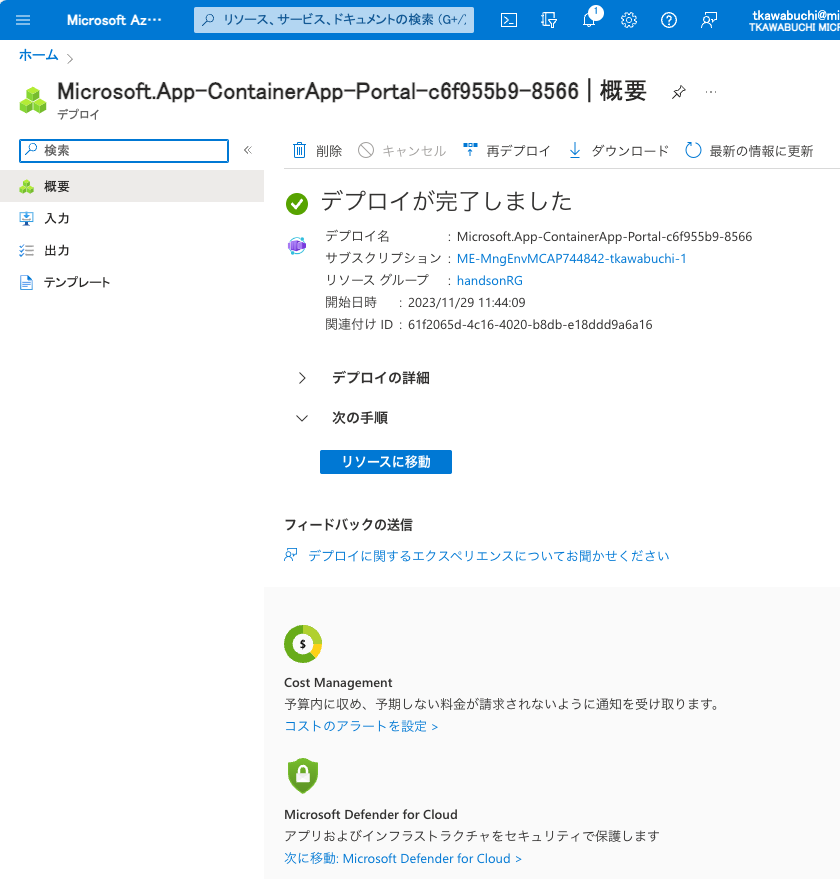

# TASK03: Azure Container Apps でのコンテンツの手動デプロイを体感

 
 

* Azure Container Apps を利用して、コンテナによるコンテンツの手動デプロイをしていきます。
  * コンテナは、TASK02で作成したイメージを利用します。

## 1. 事前準備 Azure Container Apps の作成

 
 

クイックスタートを利用してAzure Container Apps環境およびAzure Container Appsを新規に作成します。

`基本`タブ
* サブスクリプション: 今回のHandsOnで利用可能なサブスクリプション
* リソースグループ： handsonRG-NN（同一 Azure　サブスクリプション内でユニークなRG名、NNはチーム独自の数字など）
* コンテナー アプリ名：acahandsonNNNNNNNN(任意の文字列ですが、本 Azure サービス内でユニークである必要あり)
* Container Apps 環境
  * 地域: Japan East
  * Container Apps 環境: 新規作成
* 上記以外デフォルト値
 
> [!WARNING]
> * サブスクリプションについて、必ず今回のHandsOn用のものであることを確認してください。
> * 商用環境で利用しているサブスクリプションへ誤ってデプロイしないように注意してください。
> * また、複数チームで同一のサブスクリプションを利用している場合、リソースグループの後に参加チーム独自の数字をつけるなどして、重複しないようユニークとなるようにしてください。

 
 

 
 

Container Apps環境の新規作成をクリック
`基本`タブ
* 環境名: acae-handson
* 上記以外デフォルト値
  
`ワークロードプロファイル`、`監視`、`ネットワーク`タブ
* 全てデフォルト値

 
 

 
 

 
 

 
 

作成をクリックし、 Container Apps　に戻り

 
 

 
 

`コンテナー`、`Bindings`、`タグ`、`確認と作成`タブ
* 全てデフォルト値
  
 
 

 
 

 
 

 
 

 
 

作成をクリック

 
 

 
 

デプロイが完了したら`リソースに移動`をクリックし作成した`Container Apps`の概要画面を表示

 
 

 
 

つづいて`アプリケーション URL`をクリックし、クイックスタートの画面が表示されることを確認

 
 

 
 

## 2. Azure Container Apps への手動デプロイ

 
 

前 Task にて作成したコンテナイメージをデプロイします。左メニューより、[アプリケーション]-[`リビジョン`]をクリックし

 
 

 
 

続いて、上部の`新しいリビジョンを作成`
`コンテナー`タブ
* リビジョンの詳細
  * 名前/サフィックス: nginx-js-1
  * その他： デフォルト値
* コンテナー イメージ

 
 

 
 

元からある、クイックスタートのコンテナ`simple-hello-world-container`を選択（チェックボックス）して、`削除`をクリック

 
 

 
 

`+ 追加`をクリックし、`アプリコンテナー`をクリック
`基本`タブ
* コンテナーの詳細
  * 名前：　nginx-js
  * イメージのソース：　Docker Hubまたはその他のレジストリ
  * イメージとタグ: `[REPLACE-YOUR-DOCKER-ID]`/nginx-js:v1
* コンテナー リソースの割り当て
  * CPU コア：　0.25
  * メモリ (Gi): 0.5
* 上記以外デフォルト値

> [!CAUTION]
> 以下`[REPLACE-YOUR-DOCKER-ID]`は必ず、自身の Docker ID に置き換えてください！

`追加`をクリック

 
 

 
 

`作成`をクリック

 
 

 
 

新規にリビジョンが作成されトラフィックが100、さらに古いリビジョンのトラフィックが0になっていることを確認

 
 

 
 

画面上部の`最新の情報に更新`をクリック
古いリビジョンが、アクティブなリビジョンから消えていることを確認

 
 

 
 

`概要`メニューに戻り

 
 

 
 

`アプリケーション URL`をクリック
TASK02で作成したコンテナイメージがデプロイされていることを確認

 
 

 
 

左メニューより、[アプリケーション]-[`リビジョン`]に戻り、

 
 

 
 

続いて、上部の`新しいリビジョンを作成`
`コンテナー`タブ
* リビジョンの詳細
  * 名前/サフィックス: nginx-js-2
  * その他： デフォルト値
* コンテナー イメージ
  * `nginx-js`をクリック

`コンテナーの編集`
* コンテナーの詳細
  * イメージとタグ: `[REPLACE-YOUR-DOCKER-ID]`/nginx-js:v2

> [!CAUTION]
> 以下`[REPLACE-YOUR-DOCKER-ID]`は必ず、自身の Docker ID に置き換えてください！

 
 

 
 

上記以外そのままで`保存`をクリック

 
 

 
 

コンテナー イメージのタグが`v2`になっていることを確認して`作成`をクリック

あたらしい`リビジョン`としてデプロイされていることを確認

 
 

 
 

`概要`メニューに戻り
 
 

 
 

`アプリケーション URL`をクリック
TASK02で作成した v2 コンテナイメージがデプロイされていることを確認します。
 
 

 
 

以上でこちらのタスクは完了です。

---

## アジェンダ
+ [TASK0: 事前準備](README.md#task0-%E4%BA%8B%E5%89%8D%E6%BA%96%E5%82%99)
+ [TASK1: docker build 用 VM を作成](01-create-a-vm-for-docker-build.md)
+ [TASK2: VM でのコンテンツの手動デプロイを体感](02-vm-manual-deploy.md)
+ [TASK3: Azure Container Apps でのコンテンツの手動デプロイを体感](03-containerapps-manual-deploy.md)
+ [TASK4: Azure Container Apps での CI/CD を体感](04-containerapps-cicd.md)
+ [TASK5: Azure WebApp for containers でのコンテンツの手動デプロイを体感](05-webapp-manual-deploy.md)
+ [TASK6: Azure WebApp for containers での CI/CD を体感](06-webapp-cicd.md)
