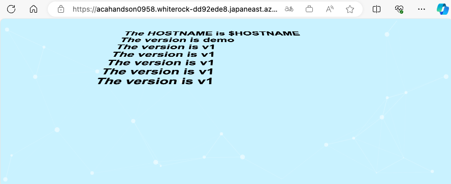

# TASK05: Azure WebApp for containers でのコンテンツの手動デプロイを体感

 
 

* Azure WebApp for containers を利用して、コンテナによるコンテンツの手動デプロイをしていきます。
  * コンテナは、TASK02で作成したイメージを利用します。

## 1. 事前準備 Azure WebApp for containers の作成

 
 

 
 

クイックスタートを利用してAzure Appサービスプラン 環境および　Azure WebApp for containers（Webアプリ）　を新規に作成します。

`基本`タブ
* サブスクリプション: 今回のHandsOnで利用可能なサブスクリプション
* リソースグループ： handsonRG-NN（同一 Azure　サブスクリプション内でユニークなRG名、NNはチーム独自の数字など）
* インスタンスの詳細
  * 名前: webapphandsonNNNNNNNN(任意の文字列ですが、本 Azure サービス内でユニークである必要あり)
  * 公開: Docker コンテナー
  * オペレーティング システム: Linux
  	Windows
  * 地域: Japan East
* 価格プラン
  * Linux プラン（Japan East）: 新規作成
  * 価格ブラン：　Basic B1
* 上記以外デフォルト値
 
> [!WARNING]
> * サブスクリプションについて、必ず今回のHandsOn用のものであることを確認してください。
> * 商用環境で利用しているサブスクリプションへ誤ってデプロイしないように注意してください。
> * また、複数チームで同一のサブスクリプションを利用している場合、リソースグループの後に参加チーム独自の数字をつけるなどして、重複しないようユニークとなるようにしてください。

 
 

 
 

`データベース`、`Docker`、`ネットワーク`、`監視`、`タグ`、`確認と作成`タブ
* 全てデフォルト値
  
 
 

 
 
 

 
 

 
 

 
 

 
 

 
 

作成をクリック

 
 

 
 

 
 

デプロイが完了したら`リソースに移動`をクリックし作成した`Webapp`の概要画面を表示

 
 

 
 

つづいて`既定のドメイン`をクリックし、クイックスタートの画面が表示されることを確認

 
 

 
 

## 2. Azure WebApp for containers への手動デプロイ

 
 

前 Task にて作成したコンテナイメージをデプロイします。左メニューより、[デプロイメント]-[`デプロイ センター`]をクリックし

 
 

 
 

* レジストリの設定
  *　レジストリ ソース：　dockerhub 
  * 完全なイメージの名前とタグ: `[REPLACE-YOUR-DOCKER-ID]`/nginx-js:v1
* 上記以外デフォルト値
  
 
 

 
 

画面上部の`保存`をクリックし設定を反映

> [!CAUTION]
> 以下`[REPLACE-YOUR-DOCKER-ID]`は必ず、自身の Docker ID に置き換えてください！

`概要`メニューに戻り

 
 

 
 

`既定のドメイン`をクリック
TASK02で作成したコンテナイメージがデプロイされていることを確認（変更されない場合、ブラウザの更新をクリック）

 
 

 
 

左メニューより、[デプロイメント]-[`デプロイ センター`]に戻り、

* レジストリの設定
  *　レジストリ ソース：　dockerhub 
  * 完全なイメージの名前とタグ: `[REPLACE-YOUR-DOCKER-ID]`/nginx-js:v2
* 上記以外デフォルト値

画面上部の`保存`をクリックし設定を反映

> [!CAUTION]
> 以下`[REPLACE-YOUR-DOCKER-ID]`は必ず、自身の Docker ID に置き換えてください！

 
 

 
 

`概要`メニューに戻り

 
 

 
 

`既定のドメイン`をクリック
TASK02で作成した v2 コンテナイメージがデプロイされていることを確認します。（変更されない場合、ブラウザの更新をクリック）

 
 

 
 

以上でこちらのタスクは完了です。

---

## アジェンダ
+ [TASK0: 事前準備](README.md#task0-%E4%BA%8B%E5%89%8D%E6%BA%96%E5%82%99)
+ [TASK1: docker build 用 VM を作成](01-create-a-vm-for-docker-build.md)
+ [TASK2: VM でのコンテンツの手動デプロイを体感](02-vm-manual-deploy.md)
+ [TASK3: Azure Container Apps でのコンテンツの手動デプロイを体感](03-containerapps-manual-deploy.md)
+ [TASK4: Azure Container Apps での CI/CD を体感](04-containerapps-cicd.md)
+ [TASK5: Azure WebApp for containers でのコンテンツの手動デプロイを体感](05-webapp-manual-deploy.md)
+ [TASK6: Azure WebApp for containers での CI/CD を体感](06-webapp-cicd.md)
