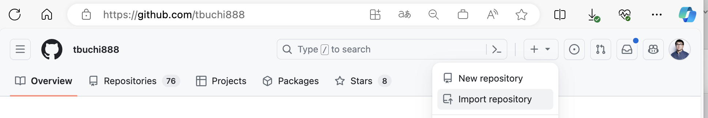
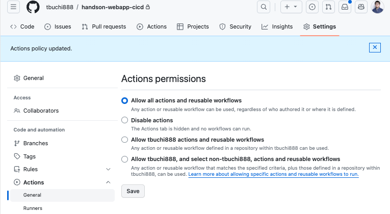
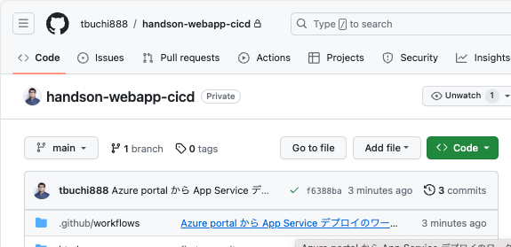
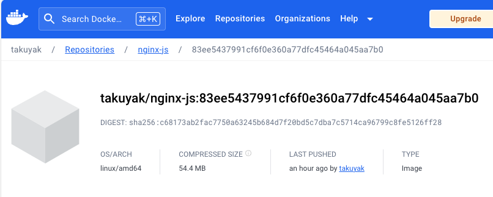

# TASK06： Azure WebApp for containers での CI/CD を体感

 
 
Azure WebApp for containers と Github リポジトリを連携し、Github Actions により コンテナイメージのビルド（CI）と Azure WebApp for containers へのデプロイをしていきます。

## 1. 事前準備 Github リポジトリの作成

 
 
Azure WebApp for containers の CI/CD に利用する Github リポジトリの作成します。

[https://github.com/](https://github.com/) へログインします。
画面右上メニューの`＋`より`Import repository`を選択してクリックします。

 
 

 
 

以下を入力して`Begin import`をクリックします。

* Your old repository’s clone URL: [https://github.com/tbuchi888/demo-handson-aca-cicd.git](https://github.com/tbuchi888/demo-handson-webapp-cicd.git)
* Repository Name: handson-webapp-cicd
* Privacy: Private（任意 Publicでも可）
* Importing complete! Your new repository [YOUR-GITHUB-ACCOUNT-NAME]/handson-webapp-cicd is ready.と表示されるまでまって 表示されている作成されたリポジトリへのリンクをクリックします。

 
 

 
 

 
 

 
 

つづいて、右上メニュー`Settings`をクリックし、左メニューの[General][Code and automation][Actions][General]より
Actions permissions　の設定を　`Allow all actions and reusable workflows`へ変更し`Save`をクリックし、Github Actions の実行をこのリポジトリで許可します。

 
 

 
 

## 2. Azure WebApp for containers での継続的デプロイ（CI/CD）の設定

 
 
Azure Portal より、TASK05 で作成した Azure WebApp for containers と Github レポジトリ、Docker hub を連携するCI/CDを設定します。

 
 

> [!TIP]
> GitHub Actions を使用した Azure WebApp for containers へのデプロイについて、手動で設定を行う場合、
> [https://learn.microsoft.com/ja-jp/azure/app-service/app-service-sql-asp-github-actions](https://learn.microsoft.com/ja-jp/azure/app-service/app-service-sql-asp-github-actions)を参考に、
> `Service Principal` の作成や、GitHub Actions 側でパスワード等`Secret`等の設定、ワークフローの作成が必要となりますが、
> 今回は、Azure WebApp for containers　で用意されている`デプロイセンターの`機能により、自動的にワークフローの設定を行います。

 
 
Azure WebApp の左メニューより、[デプロイメント]-[`デプロイ センター`]をクリックし`ソース：　Github Actions`　を選択します。

 
 

 
 

`アプリに対して基本認証が無効になっています。有効にするには、こちらをクリックして構成設定に移動してください。`メッセージが表示されるためクリックをして設定を変更します。

 
 

 
 

`全般設定`タブをクリックし、以下設定を変更して、画面上部メニューの`保存`をクリック

* プラットフォームの設定
  * 基本認証の発行資格情報: オン（オフからオンへ変更）

 
 

 
 

 
 

`続行`をクリックして変更を反映させます。

 
 

右上の`X`をクリックし、`デプロイ センター`へ戻ります。

 
 

 
 

以下設定値に変更して、画面上部の`保存`をクリックし設定を反映

> [!CAUTION]
> 以下`[REPLACE-YOUR-DOCKER-ID]`、 [REPLACE-YOUR-DOCKER-PASSWORD]は必ず、自身の Docker ID、パスワード に置き換えてください！

* GitHub　Actions
  * 次のユーザーとしてサインイン： さきほどインポートした　HandsOn用のものと同じGithubアカウントと連携し（Authorize Azure App Service Authentication）、Azureからのリポジトリからのアクセスを許可
  * 組織: さきほどインポートした　HandsOn用のものと同じ組織
  * リポジトリ：　handson-webapp-cicd さきほどインポートした　HandsOn用のものを選択
  * ブランチ：　main
* レジストリの設定
  * リポジトリ ソース: Docker　Hub
  * ログイン: [REPLACE-YOUR-DOCKER-ID]
  * パスワード: [REPLACE-YOUR-DOCKER-PASSWORD]
  * イメージ名：　nginx-js (TASK03 で利用したものと同じイメージ名でアカウント名やタグは含めないことに注意)
* 上記以外デフォルト値

デプロイセンターイの設定が以下のように正常に完了することを確認

 
 

 
 

つづいて、Github リポジトリにもどり、CI/CDのワークフロー（`.github/workflows`）が新規追加されていることを確認

 
 

 
 

ワークフローの中身も確認します。

 
 

 
 

Github の上部メニュー[Actions]をクリックし新規に追加された CI/CD のワークフローが起動し、正常に終了（グリーンのチェックマーク）していることを確認

 
 

 
 

つづいて、ワークフローのリンクをクリックし、さらに`build`および`deploy`をそれぞれクリックし中身を確認します。

 
 

 
 

 
 

 
 

## 3. Azure WebApp for containers での継続的デプロイ（CI/CD）の実行

 
 

Azure WebApp for containers　での継続的デプロイ（CI/CD）の準備が整いましたので、
Github上のコンテンツの変更　Push　をトリガーに、Github Actions のワークフローが自動で起動し、以下 CI/CD が実行されることを確認していきます。
* CI： コンテナイメージの Build　と　docker hub へイメージが Push される
* CD： Azure WebApp for containersへ、CI でビルドされたコンテナイメージとタグ名に変更された、新規コンテンツがデプロイされる

Github 上のコンテンツの変更するために、[YOUR-GITHUB-ACCOUNT-NAME]/handson-aca-cicdのリポジトリを以下いずれかの方法で開きます。
* PC　上へをクローン（git clone）し、VSCODE　等で編集
* または　　Github Codespaces で編集
* または 推奨しませんが、Github Portal から直接コードを編集
  
以下は Github Codespaces での例

以下のファイルについて変更を行い（git commit）、 main ブランチへ　git push します。
* `html/index.html`
  * v1 を v2 に全て変更する
* `html/css/style.css`
  * 88行目の`background-color: #c9f2ff;`を任意の色（HEX値）に変更する、たとえば`#38b48b`

 
 

 
 

 
 

 
 

 
 

変更の Commit を main ブランチ への Push をトリガーにワークフローが自動起動することを確認します。

 
 

 
 

main ブランチ へ変更内容を確認

 
 

 
 

[Actions]メニューより、ワークフローが自動起動されていることを確認

 
 

 
 

ワークフローをクリックし、`build`および`deploy`のジョブの中で、変更されたコンテンツにより、コンテナイメージがビルドされる

 
 

 
 

 
 

ワークフローの正常終了を確認した後に、まず Docker hub のリポジトリへ、ビルドされたコンテナイメージが追加されていることを確認します。

 
 

 
 

つづいて、ブラウザより、Azure WebApp for containers　の`既定のドメイン`へアクセスし、コンテンツが変更されていることを確認します。

> [!TIP]
> ブラウザの更新をしても背景色が変更されない場合は、プライベートウィンドウでご確認ください

 
 

 
 

Webapp の`概要`へ戻り、コンテナが、GitHub コミット ID (SHA) を使用してタグ付けされていることを確認します。

 
 

 
 

以上でこちらのタスクは完了です。

---

## アジェンダ
+ [TASK0: 事前準備](README.md#task0-%E4%BA%8B%E5%89%8D%E6%BA%96%E5%82%99)
+ [TASK1: docker build 用 VM を作成](01-create-a-vm-for-docker-build.md)
+ [TASK2: VM でのコンテンツの手動デプロイを体感](02-vm-manual-deploy.md)
+ [TASK3: Azure Container Apps でのコンテンツの手動デプロイを体感](03-containerapps-manual-deploy.md)
+ [TASK4: Azure Container Apps での CI/CD を体感](04-containerapps-cicd.md)
+ [TASK5: Azure WebApp for containers でのコンテンツの手動デプロイを体感](05-webapp-manual-deploy.md)
+ [TASK6: Azure WebApp for containers での CI/CD を体感](06-webapp-cicd.md)
